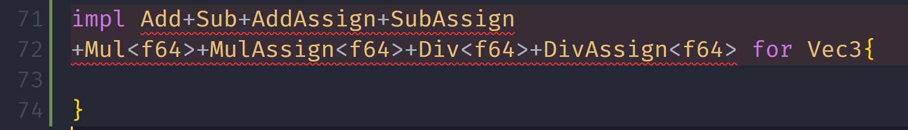
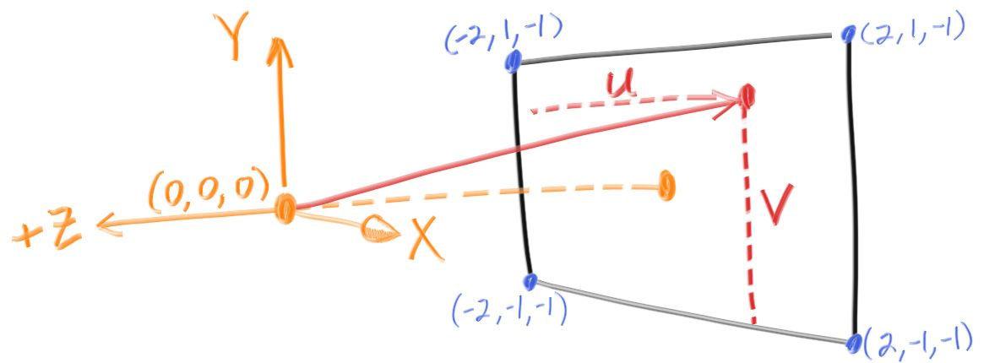

# Ray Tracing in One Week Notes
[the book](https://raytracing.github.io/)
用Rust实现

## Output an Image
了解PPM格式
```text
P3 # fixed
256 256 # weigh height
256 # colors
r g b
r g b
# left to right, and then up to down
......
```


## The vec3 Class
被Rust运算符重载折磨了一下，相比C++只需重载一个函数，Rust需要实现一个Trait，多包了一层有亿点冗长。然后左右不同类型也是要实现两次，`XXAssign`也要重新实现，很麻烦但貌似确实没啥太好的办法。(当时刚学C++运算符重载时也是一脸懵逼)



相比原文的`using point3=vec3;using color=vec3;`，Rust适合使用**new type**模式，用`tuple struct`而非`type`，实现强类型约束，不会犯把一个颜色加到一个坐标上的错误
* 经过实践，发现这样的类型约束也有那么点鸡肋的感觉，要是我习惯加.0了那不就完全不起作用了吗🤣。

## Ray, a Simple Camera, and Background
### Ray Class
起点和方向组成一束光线(t为整数时为射线)

光线追踪器发送光，并计算这些光路方向上的颜色。需要以下几步：
1. 计算从眼睛到像素的光线(光路可逆)
2. 判断哪个物体与光线相交
3. 计算出相交点上的颜色 

### 在场景中发射光线

左手系,相机在(0,0,0),x正方向为右，y正方向为上，场景的z为负数

了解了一下C++的`constexpr`函数与Rust的`const fn`。它们可以用来初始化常量；条件是保证只要所有参数都是常量表达式，返回值就一定是(编译期能计算出来的)常量表达式。
* Rust的`Trait Implement`中无法使用`const fn`，但有实验性的`impl const XXTrait for XXStruct{}`语法。
* Rust的`const fn`中进行浮点数运算是实验性的，因为考虑到跨平台问题，不能保证编译期与运行期的运算结果完全一致(虽然有IEEE，但不同平台`NaN behavior`不同)
  >[Must a const fn behave exactly the same at runtime as at compile-time?](https://github.com/rust-lang/rust/issues/77745)
* 敬佩Rust社区的严谨态度，但我没有时间深究这些`issues`, `unstable`和`experimental`了，最后还是放弃了使用过多的编译期计算

