# Ray Tracing in One Week Notes
用Rust实现，记录对the book的学习理解进程，与对Rust特性的学习探索有感

## References
[用CUDA进行GPU加速计算](https://zhuanlan.zhihu.com/p/481545755)

[用CUDA进行GPU加速计算 英文原文](https://developer.nvidia.com/blog/accelerated-ray-tracing-cuda/)

[光追资料收集](https://www.bilibili.com/read/cv2317592/)

[计算机图形学入门资料合集](https://blog.csdn.net/weixin_31226805/article/details/111969351?ops_request_misc=&request_id=&biz_id=102&utm_term=Ray%20Tracing%20in%20one%20weekend%20CUD&utm_medium=distribute.pc_search_result.none-task-blog-2~all~sobaiduweb~default-5-111969351.142^v70^wechat_v2,201^v4^add_ask)

[从光线追踪到路径追踪](https://zhuanlan.zhihu.com/p/138317358)

[总结《Ray Tracing from the Ground Up》](https://blog.csdn.net/libing_zeng/article/details/72625390)

[光栅渲染器学习总结博客](https://zhuanlan.zhihu.com/p/141210744)

## Output an Image
了解PPM格式
```text
P3 # fixed
256 256 # weigh height
256 # colors
r g b
r g b
# left to right, and then up to down
......
```
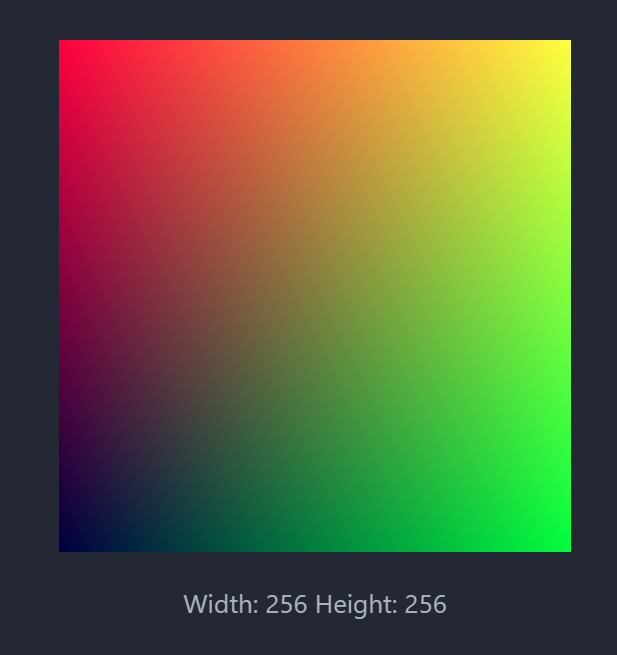

## The vec3 Class
被Rust运算符重载折磨了一下，相比C++只需重载一个函数，Rust需要实现一个Trait，多包了一层有亿点冗长。然后左右不同类型也是要实现两次，`XXAssign`也要重新实现，很麻烦但貌似确实没啥太好的办法。(当时刚学C++运算符重载时也是一脸懵逼)

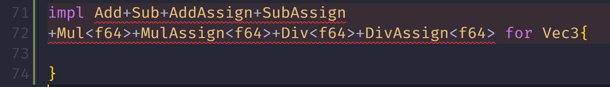

相比原文的`using point3=vec3;using color=vec3;`，Rust适合使用**new type**模式，用`tuple struct`而非`type`，实现强类型约束，不会犯把一个颜色加到一个坐标上的错误
* 经过实践，发现这样的类型约束也有那么点鸡肋的感觉，要是我习惯加.0了那不就完全不起作用了吗🤣。

## Ray, a Simple Camera, and Background
### Ray Class
起点和方向组成一束光线(t为正数时为射线)

### 在场景中发射光线
光线追踪器发送光，并计算这些光路方向上的颜色。需要以下几步：
1. 计算从眼睛到像素的光线(光路可逆)，将射线从视点发射到像素坐标
2. 判断哪个物体与光线相交，相交位置
3. 计算出相交点上的颜色

发射时射线向量并不需要是单位向量

除了设置渲染图像的像素尺寸外，我们还需要设置一个**虚拟视口**来**传递我们的场景光线**。对于标准的正方形像素间距，视口的纵横比应该与我们渲染的图像相同。我们只选择一个高度为两个单位(-1~+1)的视口。我们还**将投影平面和投影点之间的距离设置为一个单位**。这被称为“焦长度”(`focal_length`)，不是焦距！

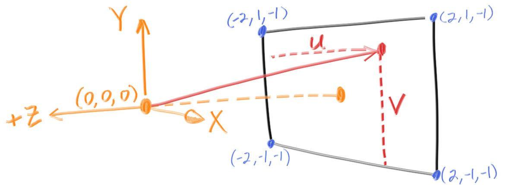

左手系,相机在(0,0,0),x正方向为右，y正方向为上，场景的z为负数

了解了一下C++的`constexpr`函数与Rust的`const fn`。它们可以用来初始化常量；条件是保证只要所有参数都是常量表达式，返回值就一定是(编译期能计算出来的)常量表达式。
* Rust的`Trait Implement`中无法使用`const fn`，但有实验性的`impl const XXTrait for XXStruct{}`语法。
* Rust的`const fn`中进行浮点数运算是实验性的，因为考虑到跨平台问题，不能保证编译期与运行期的运算结果完全一致(虽然有IEEE，但不同平台`NaN behavior`不同)
  >[Must a const fn behave exactly the same at runtime as at compile-time?](https://github.com/rust-lang/rust/issues/77745)
* 敬佩Rust社区的严谨态度，但我没有时间深究这些`issues`, `unstable`和`experimental`了，最后还是放弃了使用过多的编译期计算

线性混合公式(Blend)(其实就是二维线性插值)：

$$blendedValue=(1−t)\cdot startValue+t\cdot endValue$$

`ray_color()`利用混合公式线性地将白色与天蓝色混合，主要以下几步:

1. 确定分辨率: 假定宽度400,比例16:9
2. 确定坐标映射系统，场景左下角为(-2,-1,-1)，右上角为(2,1,-1)，中点为(0,0,-1)；摄影机(0,0,0)
3. 按像素依次发射光线、计算、混合

效果：
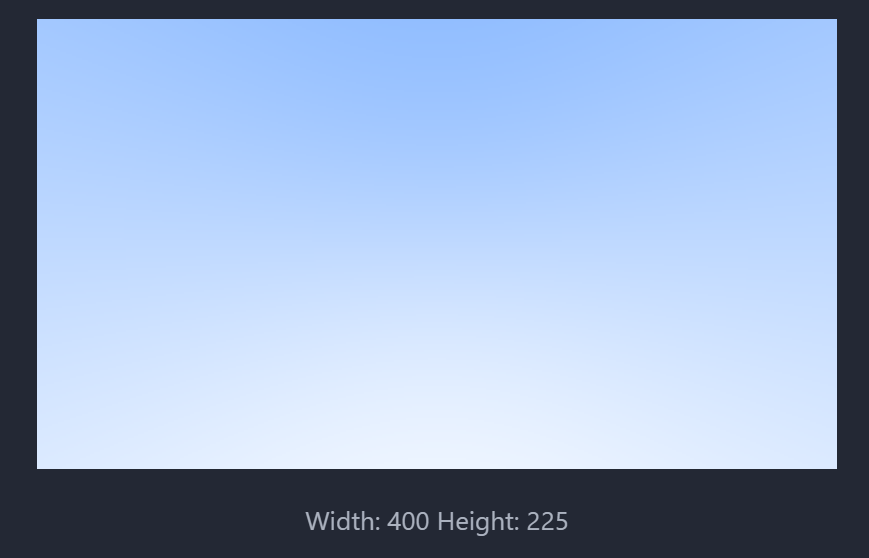

### Adding a Sphere
终于要添加真正的物体了！

计算光线有没有击中一个球体很简单，所以一般都用球体测试光追

#### 判断光与球相交
设P为一个坐标点，C为球心坐标 $\vec P=(x,y,z), \vec C =(C_x,C_y,C_z)$ ，则P在C球面上的公式为：
$$(\vec P−\vec C)⋅(\vec P−\vec C)=r^2$$
若P为光线上的点 $\vec P(t)=\vec A+t\vec b$ ,则：
$$(\vec P(t )−\vec C)⋅(\vec P(t)−\vec C)=r^2$$
或者把光线函数扩展为点向式:
$$(\vec A+t\vec b−\vec C)⋅(\vec A+t\vec b−\vec C)=r^2$$
整理得到:
$$\vec b\cdot \vec b \cdot t^2+2\vec b\cdot(\vec A−\vec C) \cdot t+(\vec A−\vec C)⋅(\vec A−\vec C)−r^2=0$$
是关于t的二次方程

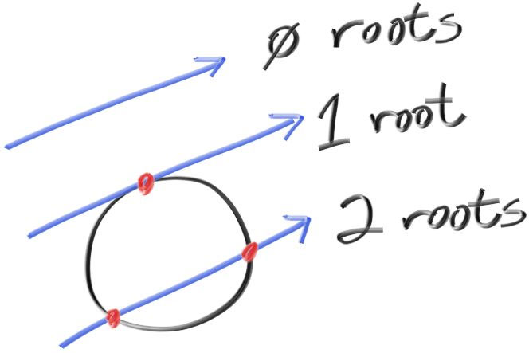

#### 完成第一幅光追图像
没有着色，也没有反射的球图像


还有个bug(特性😅)是判断球时t的解可以为负数，所以如果把球z坐标改成`-1`你仍然可以看到你背后的球

### Surface Normals and Multiple Objects
#### 用表面法线着色
法线是在相交点上与表面垂直的向量。长度方面，是单位向量的话比较方便着色。方向方面，对球来说向外的法线是交点减去球心

可视化法线的常用技巧是直接把法线方向映射到RGB上。它对单位向量法线来说很简单直观。

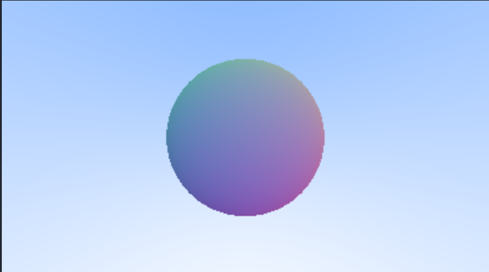

#### 优化公式

#### 抽象出与光线交互的物体Object
当前球被硬编码到`ray_color`中，难以方便地添加更多物体，所以需要抽象出能与光线交互的物体类。在Rust中是用行为来抽象成Trait，命名为`Hittable`

内含成员函数`hit(r: &ray,t_range: &std::ops::Range<f64>) -> Option<HitRecord>`
* `HitRecord`用于记录光打在物体上的t值、法线、交点与法线朝向信息(从内往外还是从外往内，通过光线方向与朝外法线的点乘结果来判定，点乘大于零->同向->法线从内往外)
* `t_range`能方便地限制想要与光交互的物体区域范围

很容易为球体实现该`Trait`

#### `HittableList`
存储`Hittables`的集合类型，利用多态，同时存储不同类型的`Hittables`。在Rust中用`Vec<Box<dyn Hitable>>`存储

场景`World`就可以用一个`HittableList`来表示，里面有多个物体，不用每个都分别调用`ray_color`来获取颜色

### Antialiasing 抗锯齿

真实的相机由于在物体边缘像素同时获取了前景物体光线和背景光线，所以不会有突兀的锯齿，而是过渡柔和自然。我们可以通过在一个像素里混合多份颜色采样来抗锯齿

#### 一些通用函数
先写一个`0≤x<1`的随机数生成器，<1很重要。
用Rust的`rand crate`实现

#### 相机类 & 用多份样本生成像素
在光追世界里，相机是用主动发出光线然后获取光线与物体交互信息的形式来模拟真实世界中相机接收光线的。相机需要横纵比，场景范围和起点信息。采用浮点数场景坐标而非像素坐标。可以随意指定像素数量。需要`get_ray`方法来生成光线

在原有像素坐标计算出场景坐标的周围随机生成采样点坐标，进行采样后平均成最终颜色

### Diffuse(Matte) Materials
漫反射(无光泽；磨砂)材质特性：
* 不是像镜面反射一样只呈现出周围环境的颜色，而是用自己固有的颜色来调节这种颜色
* 对光线吸收率较高，显得较暗
* 只要反射光线方向随机就能实现漫反射效果。
 
先实现最简单的理想漫反射表面模型(ideal diffuse surfaces)，它是`Lambertian`反射(理想散射)模型的简化实现(simple hack,inaccurate)
* Lambertian表面是指在一个固定的照明分布下从所有的视场方向上观测都具有相同亮度的表面，Lambertian表面不吸收任何入射光．Lambertian反射也叫散光反射，不管照明分布如何，Lambertian表面在所有的表面方向上接收并发散所有的入射照明，结果是每一个方向上都能看到相同数量的能量．

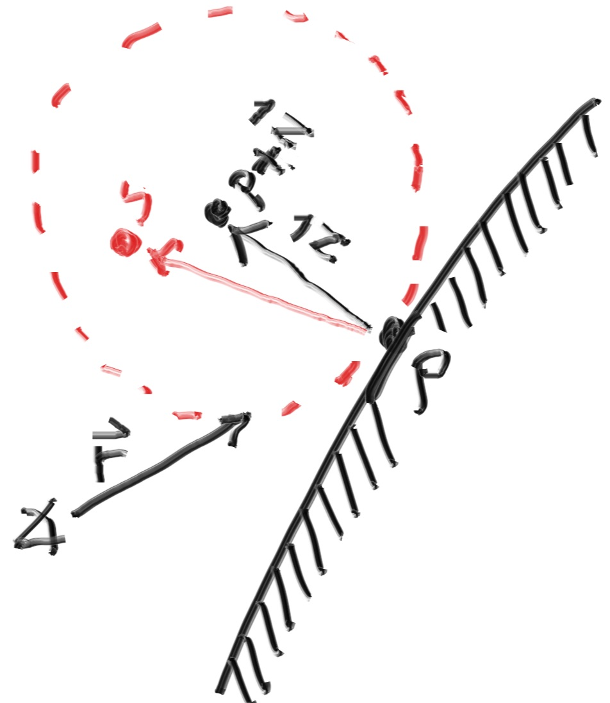
在法向量长度为半径，光线与物体交点+法向量为球心的球上随机取点，生成反射光线

反射光线使`ray_color`变为了递归函数，不射到任何物体才会结束递归。所以此外我们还需要限制递归的最大层数

#### 用伽马矫正精确的颜色强度
>[优秀参考资料：到底什么是伽马校正 Gamma Correction?](https://zhuanlan.zhihu.com/p/33637724)
>[简易资料：伽马矫正与LUT](https://blog.csdn.net/dx199771/article/details/111504446)

显示器都假设图像是经过伽马矫正的，所以我们也需要将原始图像进行伽马矫正来得到正常的显示效果。我们选择简易的`gamma 2`,只需对原始颜色(`[0,1)`)开平方根，再映射到`[0,255]`即可

#### Fixing Shadow Acne
为了消除阴影的毛刺，需要忽略t十分接近0(与自己相交)的射线

#### 真正的Lambertian Reflection
实现上的区别只是把在球中生成的随机向量单位化了，但具体原理没懂

效果：
* 阴影淡了一些
* 球的颜色更浅了

这两种变化都是由于光线的散射更加均匀，更少的光线向法线散射。
* 对于漫反射的物体，它们会显得更浅，这是因为有更多的光反射到相机上。
* 对于阴影，向上反射的光线较少，因此正处于较小球体下方的大球部分更亮。

### 金属材质&镜面反射 Mirrored Light Reflection
#### 对材料的抽象
材料可以选择和具体物体绑定，也可以不绑定。这里就不绑定了，而是物体持有材质的`Rc`智能指针

材料需要处理两个问题：
1. 如何创造反射/散射光(即如何吸收、转化入射光)
2. 光线衰减量如何

diffuse:
1. 视线与物体表面产生撞击点p，在p处相切单位圆内随机找一点s，散射光方向即p->s
2. 光线强度衰减一半(Color直接乘0.5，红绿蓝同时减少一半，相当于只减小光强不改变颜色，最后呈中性灰色)

metal:
1. 镜面反射，根据反射定律，由入射光直接确定反射光方向
2. 红绿蓝衰减程度不同，使不同金属呈现不同颜色。用参数自由确定

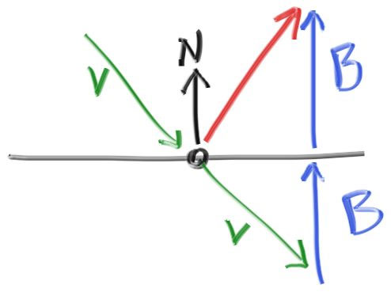
由于我们的法向量是单位向量，所以 $|\vec b| = \vec v * \vec n$
公式: 出射光线 $\vec o = \vec v - 2\vec n \times (\vec v\cdot \vec n)$

##### 实现细节
实现了`Material trait`的`struct`是一种材料，它的`scatter`方法可以通过`入射光`与`HitRecord`确定出射光与其颜色。通过前述方法分别实现`Lambertian`与`Matel`

问题：漫反射抽象时可能产生的反射光与法线接近反向，加起来接近0导致`NaN`或者`Inf`
解决方案：特判接近零的情况，返回法线方向

物体与`HitRecord`都持有材质的共享型智能指针

修复之前`impl Mul<Vec3> for Vec3`的严重bug

#### Fuzzy Reflection 模糊反射
现实的金属很难做到像镜子一样精准地反光，而是有一定的模糊效果。对镜面反射出射方向进行少量的随机扰动，获得模糊反射效果

### Dielectrics & Refraction
Dielectrics：电介质，如空气、玻璃、水、钻石。

对于光(属于电磁波)来说，传播不需要任何介质，所以在真空里也可以传播。

在不同电介质中的传播与真空中传播有所不同，如：
* 在越稀疏的介质中传播速度越快
* 从一种介质斜射入另一种介质时，由于惠更斯原理/光和物质间的相互作用力(近代物理)，会在交界处发生偏折，传播方向改变，这种现象即为折射(Refraction)

光击中电介质表面时既会折射进入介质，又会反射而离开介质，但我们的一束光线只能选择其一，所以我们随机选择折射或反射之一作为散射方式，经过多次取样的平均，最终效果相同

#### 折射
斯涅尔定律(Snell's Law，折射定律)：
$$\eta_1\sin \theta_1 = \eta_2\sin \theta_2$$

其中 $\theta_1$ 为入射角， $\theta_2$ 为折射角， $\eta_1$  $\eta_2$ 分别是两种介质的折射率( $\geq 1$ )
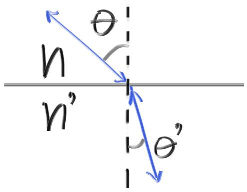
玻璃1.3~1.7，钻石2.4

计算折射角：

$$\sin \theta_2 = \frac {\eta_1} {\eta_2}\sin \theta_1$$

首先入射光、法线、折射光、(反射光)都在一个平面内。我们可以在平面上将折射光`R'`分解成两个垂直的部分来计算 

$$\vec R'=\vec {R'_\perp}+\vec {R'_\parallel}$$

可以解出 

$$\vec {R'_\perp}=\frac {\eta_1} {\eta_2}(\vec R+\cos \theta_1 \vec n),$$

$$\vec {R'_\parallel} = - \sqrt{1- |\vec {R'_\perp}|^2}\vec n,$$

其中 $\cos \theta = \frac {\vec a \cdot \vec b} {|\vec a| |\vec b|}$ ，可将公式化为

$$\vec {R'_\perp}=\frac {\eta_1} {\eta_2}(\vec R+(-\vec R \cdot \vec n)\vec n)$$

#### 全反射
全反射与临界角：折射率太大会导致Snell's Law没有实根，即没有折射可能，只会反射，这就是全反射。折射角公式：

$$\sin \theta_2 = \frac {\eta_1} {\eta_2}\sin \theta_1$$

公式中如果 $\eta_1=1.5, \eta_2=1.0, \sin \theta_1>\frac 2 3$ 时 $\sin \theta_1>1$ ，折射角无解,发生全反射

#### Schlick Approximation
现在我们的电介质要么只折射光线，要么只全反射光线。实际上的电介质根据入射角度会有不同的折射与反射比例，而不是二者只择其一。

There is a big ugly equation for that, but almost everybody uses a cheap and surprisingly accurate polynomial approximation by Christophe Schlick. 

#### 建模空心玻璃球
电介质的一个有意思且简单的花样就是空心玻璃球，如果半径为负数，球的空间范围没有改变，但表面的法向量反向了，这可以用来在球里打一个空气泡。

### Positionable Camera
让相机可以移动、旋转、缩放

相机和电介质都很难调试(确实)。所以应当渐进式地开发。先允许视野/视场角(FOV,Field of View)可以调节；再开发位移和旋转。

FOV横向和纵向不同，以横向为基准，纵向对横向乘一个洗漱。

#### Camera Viewing Geometry
先让相机对准z轴负方向，h作为向量与z轴的距离

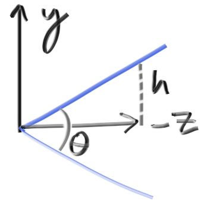
(图片不够直观， $\theta$ 视场角是两倍与z轴的夹角，所以计算tan要除以2, $h = \tan {(\frac \theta 2)}$ )

#### Positioning and Orienting the Camera
`look_from`点到`look_at`点，加上`view_up`代表相机指向上方方向的向量，确定了一个相机的位置、朝向与旋转角度；再加上之前的视场角`vfov`就能确定获取图像的范围

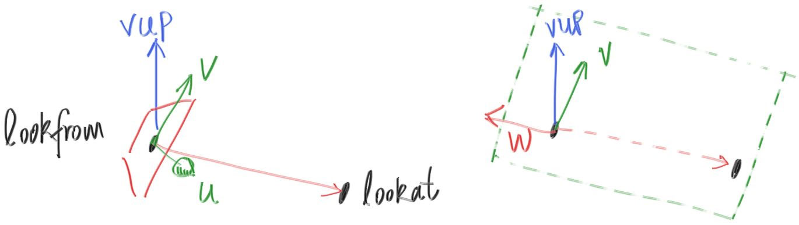
用它们算出u,v,w,最终算出`origin`、`horizontal`、`vertical`、`lower_left_corner`这些变量

### Defocus Blur
我们现在的光线都从`look_from`发出，相当于成像到了一个质点上，不会有任何景深模糊效果。为了模拟景深模糊效果可以让光线从与(`look_at-look_from`)向量垂直的平面上的 以`look_from`为圆心的圆里随机选一点进行出射。出射到焦平面(focus plane)上，这个平面上的物象都是完全清晰的。

实际是模拟了真实相机的一半：只模拟镜头之外的部分，而没有必要模拟镜头内的部分
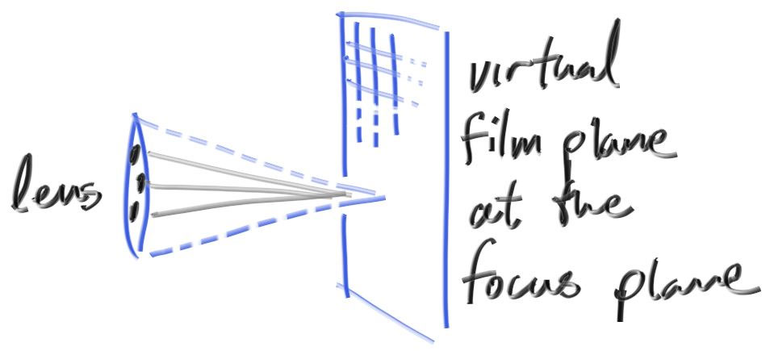

### 成果
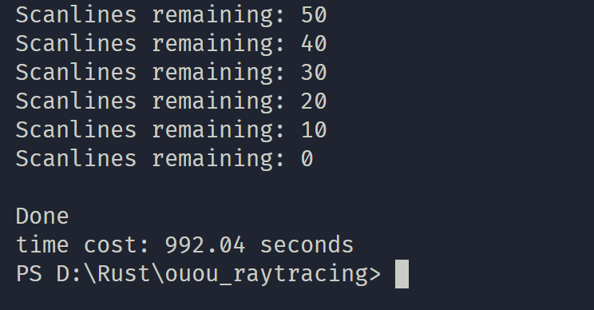
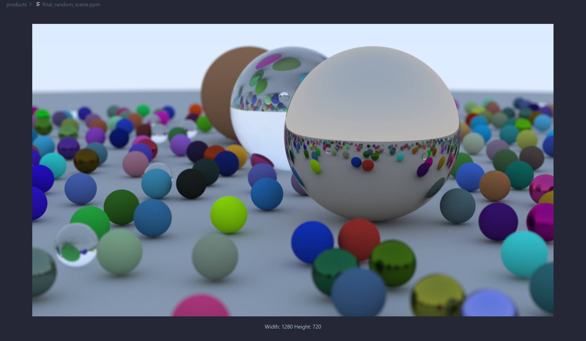

from 
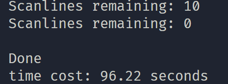
to
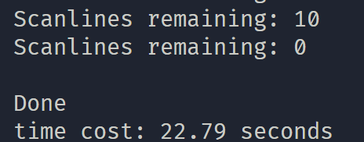
using Rayon

#### 交流
[Remda：3本,Rust,Rayon并行优化](https://rustcc.cn/article?id=bffdbc8b-1c99-4d1d-942c-91365b6ada0d)
[fralken: 3本,Rust,Rayon并行优化](https://github.com/fralken/ray-tracing-in-one-weekend)
[Rust, high-performance](https://github.com/skyzh/raytracer.rs/)
[Writing About Ray Tracing in One Weekend with Rust Blog](https://andy.stanton.is/writing/about/ray-tracing-in-one-weekend/)
[How can I share immutable data between threads in Rust?](https://stackoverflow.com/questions/62744175/how-can-i-share-immutable-data-between-threads-in-rust?r=SearchResults)
#### 进步
[多线程编程的秘密：Sync, Send, and 'Static](https://zhuanlan.zhihu.com/p/362285521)
[Rayon 并行优化](https://developers.redhat.com/blog/2021/04/30/how-rust-makes-rayons-data-parallelism-magical#generic_constraints_in_rayon)
[BVH场景管理加速光线追踪](https://blog.icysky.site/archives/164)
[BVH](https://blog.csdn.net/m0_56399931/article/details/124145240)

### 总结
#### 《Ray Tracing in One Weekend》之旅
在被中间一次旅游打断的总共花了一周的《Ray Tracing in One Weekend》之旅中我走进了光线追踪的世界：
* 从镜头里射出光线，再通过光路可逆原理得到进入镜头射到某个像素点上的光线颜色；
* 看似简单却又有许多门道的随机能产生出漫反射纹理；
* 光源与接触物体颜色RGB分别相乘得到的就是它们“混合”出的颜色(因为物体本身常常呈现的颜色其实是它对不同波长光线的出射率决定的)。其实对应PS里的"**正片叠底**"
* 各种数学公式推导，包括相对比较复杂的折射与全反射；
* `Schlick's approximation`等神奇的hack操作······
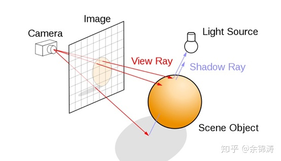

#### Rust 语言
这个项目对我的Rust来说也算是一次超纲演练。碰到了不少课本上不会出现的复杂或怪异的问题：
* 各种自定义类型到底应该选择`Copy`&`Clone`还是`Move`(`Copy`与`Clone`也混淆了，往往将两个绑定在了一起)；
* `match`中出现浮点数字面量是不受支持的行为(包括看起来无比自然的`Range`)；这个追踪了好久相关issue，了解到它无法被支持的的一些复杂原因，和暂时(或许永远)不会被弃用的消息，但为了不报警告还是用匹配守卫替代了它
* `Box<dyn T>`打包与`&dyn T`+生命周期`lifetime`管理的借用之间到底如何选择；
* 多态到底选择泛型`generic`(`impl Trait`是其语法糖，实际就是静态分发)，还是`dyn Trait Object`动态分发，还是比较少见的`enum+struct`。它们之间到底有什么本质区别，什么场景更适合选择什么；
* 忘记了`trait`可以继承(实际上相比继承更应该看作**前置依赖**)，导致并发时`trait object`缺少`Sync&Send`标记`Trait`而需要在参数里写无数遍`&dyn Hittable + Send + Sync`
······

所以现在就是一个总结提升Rust的良机
##### Copy与Clone
`Copy`: 向编译器说明该类型的语义，与`Move`相反；代表重新绑定行为时(包括`let`、函数传参)的默认行为应该是：`Clone`一份副本，原来的绑定仍有效；还是`Move`移交所有权，原来的绑定失效

`Clone`: `#[derive(Clone)]`向编译器说明该类型可以逐比特拷贝，并生成默认实现；或者手动实现语义相同而实际行为可能不同的`Clone`操作(如`Rc`的`Clone`实际是引用计数+1; `Box`的`Clone`实际是深拷贝)

##### 面向对象 & 多态
`Rust`的面向对象特性在这个项目来看是很够用的，和写C++没太大差别。
至于到底用泛型还是动态多态，动态多态 灵活/拓展性更强，省空间；泛型速度更快，而二进制代码会更大；但现在的代码来看区别不大

##### 并发
`Sync`：对象可以安全地在线程间通过不可变借用(可变借用不可能线程安全)来共享(未实现它的反例：`Rc`；`Cell`)

`Send`：对象可以安全地在线程之间传递所有权(未实现它的反例：`Rc`的引用计数是线程不安全的，所以无法实现共享所有权，需要用`Arc`)

`&T`实现了`Send` 等价于 `T`实现了`Sync`

这里其实还是没有完全搞懂，因为还涉及锁(`Mutex​`)、内部可变性(`Cell`、`​RefCell`)等问题；暂时没有研究

##### crates
`Image`: 非常丝滑，现在可以生成`png`来代替之前的`ppm`了

`Rayon`: 弄懂`Sync``Send`与`Trait`继承以后非常丝滑，让采样过程轻易地并行化，提速显著

`cargo`非常棒，但编译雀食慢...

#### 下一步
稍微看了看后面的添加光源、添加形状、材质、动态模糊、BVH加速(光线追踪硬件单元的基础)等内容。但现在有缓考科目和CPC寒假集训的压力应该暂时不会开坑了。

# Ray Tracing the Next Week Notes
[The Next Week笔记(上篇)](https://zhuanlan.zhihu.com/p/44503768)
[The Next Week笔记(下篇)](https://zhuanlan.zhihu.com/p/48643909)
[难点](https://zhuanlan.zhihu.com/p/80108202)

in one weekend 的问题：
* 只有球体->引入矩形
* 只有环境光源(蓝色渐变背景作为光源)->添加点光源等光源
* 性能太低(`hittable_list`->层次包围盒`BVH,Bounding Volume Hierarchies`)
* 只能静物->引入时间变量、动态模糊效果
* 只有出射效果，没有纹理->引入纹理贴图、柏林噪声纹理
* 没有体积渲染->添加体积烟雾，在内部发生散射

## Motion Blur
### 考虑时间的光线追踪 Introduction of SpaceTime Ray Tracing
用蛮力(Brute-Force)就可以实现动态模糊：模拟快门时间，每个像素看到的颜色是一段时间的平均；相机和物体都可以随时间移动

### 更新相机类来模拟动态模糊 Updating the Camera to Simulate Motion Blur
修改`get_ray`函数，在相机快门时间范围内随机一个时间点，假设光线在那个时间出现

### 实现移动的球体
球心在两个时间点从一处变到另一处，依此写出球心`center`关于时间的函数

以普通球体为基础写出`hit`。光线与球体相交时只考虑光线出现时间对应的球心位置，相当于只是用两点确定球的直线路径，而非只在该时间范围内存在


## BVH(Bounding Volume Hierarchies) 层次包围盒
>[层次包围盒- Raytracing The Next Week](https://zhuanlan.zhihu.com/p/77261149) 

计算光线与物体相交这个过程是光线追踪的主要时间性能瓶颈。每次发射光线后，运算时间与物体数目线性正相关。用层次包围盒实现类似二分查找效果。

(今天还看了`SIMD`相关资料，之前还学习了充分利用了并行和`SIMD`的`ndarray`库，以后可以用它替代自己的`Vec3`。当然现在没必要过早优化)

### 思路
二分地划分空间有多种方式，这里选择`AABB`(坐标轴轴对齐的包围盒)，并随机选择一个坐标轴进行排序后二分。实际上也可以按照最长的轴(左右差距最大)进行二分。

#### 所需过程
1. 构建坐标轴对齐的包围盒类(`AABB`)
   1. 为`Hittable Trait`实现`bounding_box`方法，获取其包围盒
   2. 确定每种物体(`Hittable`)的包围盒(`AABB`)。它要包裹原物体，同时越小越好
2. 实现合并两个物体包围盒的方法(`surrounding_box`)
3. 构建层次包围盒(BVH)树节点类(`BvhNode`)，每个节点拥有自己的包围盒(`AABB`)，以及两个儿子。
   1. 实现建树算法，能够将多个物体(`HittableList`/`[Arc<dyn Hittable>]`)逐层进行划分，最终将单个物体存入包围盒的叶节点中，包围盒逐层缩小。
   2. 为其实现`Hittable Trait`

#### 实现&修bug
* 因为`BVH`树形结构的所有权问题较为复杂，难以再使用`Box`或者普通引用。于是全部重构成了使用引用计数智能指针（理论上还是可以使用Box的，只是可读性会差一下）。又因为要并行处理，于是采用`Arc`。并把前面`HittableList`中的`Box`也改成了`Arc`
  * 意外发现Box版本和Arc版本的性能并没有相差很多。所以还是**不要过早优化呀**
* 改进了测试流程，将测试装入`tests`测试模块而不是在`main`里折腾
  * 只是在测试中输出错误信息需要写`$env:RUST_TEST_NOCAPTURE=1`
* 浮点数`sort`需要`sort_by`传入调用`partial_cmp`的闭包(并在里面处理错误)，而不能直接排序
* 面对成吨的`Option`，善用`if let`可以让代码不那么啰嗦
* bug fix: 区间划分忘记了是前闭后开，不小心写成了`[..mid]`和`[mid+1..]`

### 成果
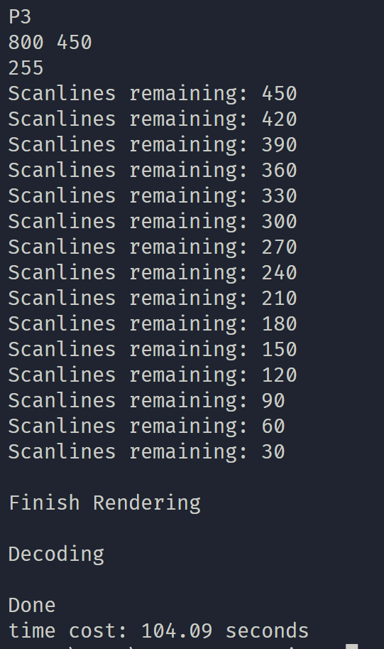 
-> 
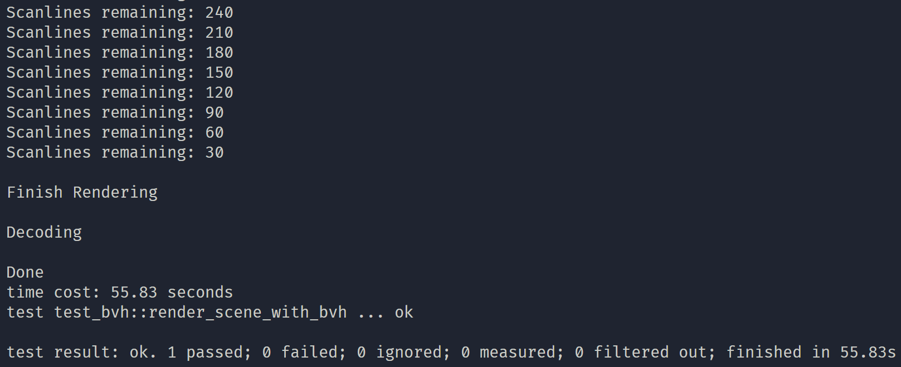

减少了一半用时，且物体越多优化效果会越明显

### 小结
这是到目前为止最大的一个挑战，之前没有用`Rust`实现过树形结构，现在通过实现`BVH`这个只读的树形结构，加深了对`Rust`智能指针的理解

## Solid Textures 固体材质
将材质贴图/颜色信息映射到形状上

### 抽象材质：Texture Trait
需要实现通过一个uv坐标确定一个颜色(`Color3`)

### 实现第一个材质：纯色材质 Constant Texture

### 球体的uv坐标
通过极坐标系(只有一个面，所以只需要仰角和方位角两个坐标，而不需要使用球极坐标系)将球上一个点与贴图平面上的一个点一一对应：
* 计算 $(\theta, \phi)$ , 其中 $\theta$ 是从南极点往上的仰角，范围 $[0,\pi]$ ;  $\phi$  是绕Y轴的方位角，范围 $[0, 2\pi]$  (from -X to +Z to +X to -Z back to -X)
* 将 $\theta$ 与 $\phi$ 映射到平面坐标系上: 

$$u=\frac \phi {2\pi},\qquad v= \frac \theta \pi, u,v \in [0,1]$$

* 为了计算以原点为球心的单位球体的 $\theta$ 和 $\phi$ ，我们需要从三维笛卡尔坐标系上一点开始计算：

$$y=−\cos(\theta) \\
x=−\cos(\phi)\sin(\theta) \\
z=\sin(\phi)\sin(\theta)$$

### Checker Texture
棋盘一样的双纯色材质，根据 

$$\sin(10\cdot p.x()) \times \sin(10\cdot p.y())\times \sin(10\cdot p.z())$$ 

的正负性来在3D面上生成Checker材质

### 实现细节
* 进一步改进了测试流程，具体如下
  * 之前不小心使用了集成测试，放在项目目录`/tests`下，本质上是在`crate`的外部对整个`crate`进行测试，并太适合我实际上的测试内容。
  * 于是改成了单元测试，放在`/src/test`模块中，测试代码并会不对外公开(暴露)。
  * 测试图片统一放至`/imgs/test`，并以测试函数名来命名(`Rust`没有反射，暂时也没有像`C/C++`一样的`__func__`官方宏来输出当前函数名，所以只能利用第三方库`function_name`来获取当前函数名)
  * 缩小了测试图片的输出分辨率，减少出射递归层数，提高测试效率
* 还改进了项目结构，增加了一些模块层次(`hittable`,`material`,`textures`,`test`)让项目代码更清晰(`use`暂时比较杂乱，以 后再整理)

### 成果


## Perlin Noise 柏林噪音
[从随机数到自然界中的噪声之一Value Noise](https://zhuanlan.zhihu.com/p/77596796)
[从随机数到自然界中的噪声之二-Perlin Noise](https://zhuanlan.zhihu.com/p/77628759)
>[柏林噪声 (多图)](https://blog.csdn.net/u010669231/article/details/97051705)
### 概述
自然界的噪声：局部变化小；全局变化大

伪随机生成的白噪音：局部变化大；全局完全无规律可言

### 柏林噪音优势
* 获得比白噪音(纯粹随机)更自然的随机纹理
* 有可再现的特性(同样的点返回同样的随机信息)
* 在一点的周围颜色较为均匀
* 而且计算快速

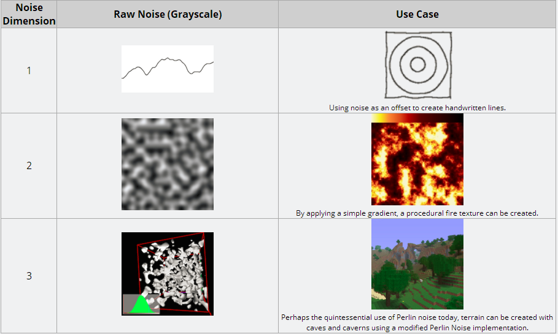

### 用随机数生成纹理
用一个随机数列生成纹理，将一个单位(如一个1边长立方体)当作一块，映射到一个颜色。纹理明显会重复且无序

### 将坐标进行哈希
纹理不再那么重复，但还是完全无序，不好看

### 平滑化
用`三线性插值`对纹理进行平滑化，结果变模糊了

但还是不够平滑，因为在立方体格点中心还是完全随机进行突变的(最值总是精确落在整数x/y/z上)，结果有明显的网格特征

### Hermitian平滑化
不用线性插值，而改用`Hermitian`平滑化插值

平滑了很多但效果还是不自然

### 支持改变频率
增加缩放因子将纹理进行缩放

### 真正的柏林噪声
在格点上存储`xyz`三个方向随机向量，而非粗暴地存储一个值作为颜色灰度，四个格点组成正方形形成一个晶格

计算一点颜色时哈希到某一个晶格，并获取相对晶格左下角格点的位置向量，将其作为梯度，按一定的加权计算出像素灰度，这样就生成出了较为标准的`Perlin`噪声纹理。

(没有完全搞懂，这里可能有错误，参考[https://www.cnblogs.com/leoin2012/p/7218033.html](https://www.cnblogs.com/leoin2012/p/7218033.html))

还能进行一些叠加或变化(取绝对值，加旋度···)形成更奇特的噪声纹理

## Image Texture Mapping 图像材质映射
和噪声纹理相比，显然能显示一个地球仪更加有趣，所以先看这章吧。

为了实现与不同图像分辨率的兼容性，通常把uv坐标先映射到一个图像位置的比值而非具体的一个像素点。对于 $N_x \times N_y$ 图像像素点`(i,j)`:
$$u = \frac i {N_x-1}, v = \frac j {N_y-1}$$

## 存储材质图像数据
图像解析采用`image crate`，存储使用其中的`DynamicImage`，它采用的是`RGBA`四维度存储，但也能兼容`JPG`

