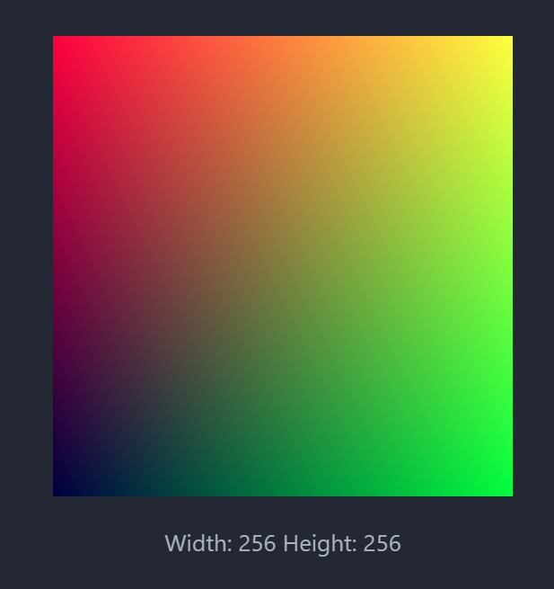

# Ray Tracing in One Week Notes
[the book](https://raytracing.github.io/)
用Rust实现

## Output an Image
了解PPM格式
```text
P3 # fixed
256 256 # weigh height
256 # colors
r g b
r g b
# left to right, and then up to down
......
```


## The vec3 Class
被Rust运算符重载折磨了一下，相比C++只需重载一个函数，Rust需要实现一个Trait，多包了一层稍微有点冗长，但也还好。(当时刚学C++运算符重载时也是一脸懵逼)

相比原文的`using point3=vec3;using color=vec3;`，Rust适合使用**new type**模式，用`tuple struct`而非`type`，实现强类型约束，不会犯把一个颜色加到一个坐标上的错误